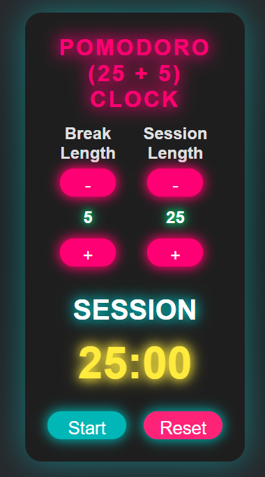

# ⏳ Pomodoro (25 + 5) Clock

A stylish **Pomodoro Timer** built with **React + Vite**.  
Set custom **Session** and **Break** lengths, start/stop the timer, reset anytime, and enjoy a glowing neon-themed UI.



---

## ✨ Features

- ⏲️ Adjustable **Session** (1–60 mins) and **Break** (1–60 mins) lengths  
- ▶️ **Start / Stop** the countdown timer  
- 🔄 **Reset** button resets everything to default (25/5)  
- 🔊 Audio alert at the end of each period  
- 🌟 Neon-inspired **modern UI with animations**  
- ⚡ Built using **React + Vite** for fast development and deployment  

---

## Live demo 🚀 
**[Pomodoro Clock](https://pomodoro-clock-self-two.vercel.app/ )**

---

## 🛠️ Technologies Used

- [React](https://react.dev/) – UI Library  
- [Vite](https://vitejs.dev/) – Lightning-fast build tool  
- [CSS3](https://developer.mozilla.org/en-US/docs/Web/CSS) – Custom styles & responsive design  

---

## 🚀 Getting Started

### 1. Clone the Repository
```bash
git clone https://github.com/Stabat47/pomodoro-clock.git
cd pomodoro-clock
```
### 2. Install Dependencies
```bash
npm install
```

### 3. Start Developement Server
```bash 
npm run dev
```

---

## 🌍 Deployment

You can deploy easily to **Vercel**, **Render**, or **GitHub Pages**.

---

### ▶ Deploy on Vercel (Recommended)

1. Go to [https://vercel.com](https://vercel.com)
2. Import your repository
3. Click **Deploy**

---


## 📂 Project Structure
```bash
pomodoro-clock/
├─ public/                 # Static files (favicon, screenshots)
├─ src/
│  ├─ components/
│  │  └─ PomodoroClock.jsx # Main Pomodoro Clock component
│  ├─ main.jsx             # Entry point
│  └─ styles.css           # Styles and responsive design
├─ .gitignore
├─ index.html
├─ package.json
└─ vite.config.js
```
---
## 🎨 UI Preview

- Neon glowing effects for buttons and text

- Responsive layout for mobile, tablet, and desktop

- Dark theme with accent colors
---

## 📝 License

This project is licensed under the **MIT License** – feel free to use and modify.

---

## 🙌 Acknowledgments

- **FreeCodeCamp’s Front End Development Libraries project**  
- **[Google Alarm Clock Sound](https://actions.google.com/sounds/v1/alarms/alarm_clock.ogg) for the beep alert**

---

## 👤 Author

- **Landoh Clansy**
- GitHub: [@Stabat47](https://github.com/Stabat47)  
  

⭐ If you like this project, consider giving it a **star** on GitHub!
